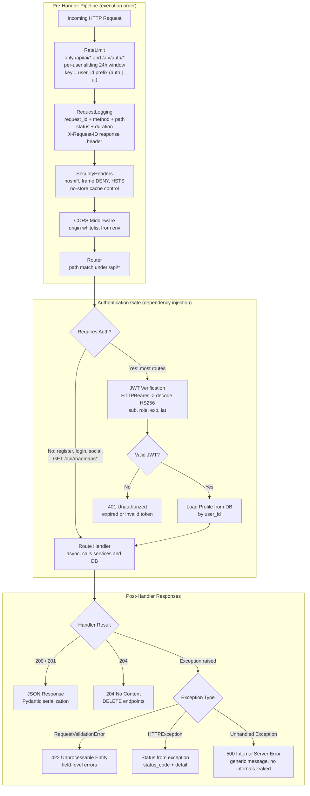
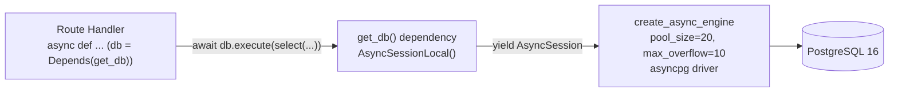
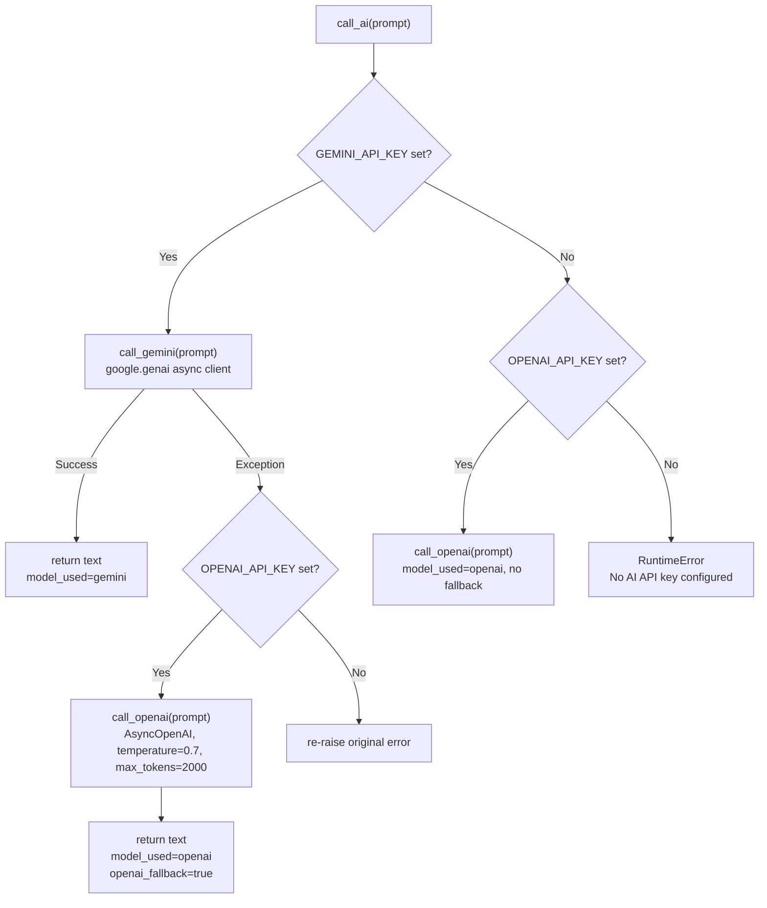

# Architecture

This document is an in-depth reference for how PathForge AI is built and how data flows through it. It is written from the current source of truth in `backend/` and `frontend/`; if it disagrees with the code, the code wins and this document should be updated.

See also: [README](../README.md), [docs/API.md](API.md), [docs/SECURITY.md](SECURITY.md), [docs/DATABASE.md](DATABASE.md), [docs/DEPLOYMENT.md](DEPLOYMENT.md).

## Overview

PathForge is a classic client–server layered architecture:

- **Client** — a React 18 SPA (Vite, Tailwind, Zustand) that renders roadmaps as interactive node graphs and talks to the backend over HTTP JSON.
- **Gateway** — a small FastAPI middleware stack (rate limiting, request logging, security headers, CORS) that runs before every request.
- **Server** — FastAPI route handlers that authenticate, validate payloads with Pydantic, and delegate to services and the ORM.
- **Data** — PostgreSQL 16 via SQLAlchemy 2.0 async (asyncpg). In-memory caches: AI responses in the `ai_explanations` table, seed content in local JSON files.
- **AI** — Google Gemini (primary) with OpenAI as an automatic fallback.

## Request Pipeline

`backend/app/main.py` registers four middlewares and three exception handlers. Note that Starlette wraps the **last-registered** middleware outermost, so the effective execution order is the reverse of the `app.add_middleware(...)` calls in the file (registration order: CORS, SecurityHeaders, RequestLogging, RateLimit).



Execution order on the way in is **RateLimit -> RequestLogging -> SecurityHeaders -> CORS -> Router**, then the auth dependency and the handler. Responses unwind back through the same stack: security headers and `X-Request-ID` are attached as the response exits, and the logger records the final status code and duration.

### Rate limiting specifics (`backend/app/middleware/rate_limit.py`)

- Only paths starting with `/api/ai/` or `/api/auth/` are rate-limited.
- The key is `"{user_id}:{prefix}"` where `prefix` is `auth` or `ai`. The `user_id` comes from `request.state.user` when set, otherwise from decoding the Bearer token, otherwise `anonymous`.
- The window is a **sliding 24 hours** (timestamps older than 86400 s are pruned before checking).
- Limits are **per day, per user** (not per IP):
  - Auth prefix: `20/day`.
  - AI prefix: `5/day` for anonymous (free) callers, `20/day` for registered users.
  - A premium tier (`AI_CALLS_PER_DAY_PREMIUM = 999`) is defined in config but is **not yet enforced** by the middleware.
- Exceeding the limit raises `HTTPException(429, "Rate limit exceeded")`.

## Layered Architecture Walkthrough

### 1. Client layer (`frontend/src`)

- **Pages** route the SPA: `HomePage` (`/`), `RoadmapsPage` (`/roadmaps`), `RoadmapDetailPage` (`/roadmaps/:slug`), `LearnPage` (`/roadmaps/:slug/learn`), `DashboardPage` (`/dashboard`), `AdminPage` (`/admin/*`), `LoginPage` (`/login`), `RegisterPage` (`/register`).
- **Route guards** (`components/shared/GuardRoute.jsx`) wrap routes: `GuestRoute` for login/register, `ProtectedRoute` for the dashboard/learn pages, `AdminRoute` for admin.
- **Components** are grouped by concern: `layout/Navbar`, `roadmap/RoadmapGraph` (React Flow graph), `learn/AIExplanation` and `learn/ResourceList`, shared primitives (`AsyncContent`, `ErrorBoundary`, `LoadingSkeleton`, `Spinner`, `Toast`), and `icons/` (GitHub, Google).
- **State** lives in a single Zustand store (`stores/authStore.js`) holding `user`, `token`, and loading state; it calls `GET /me` on boot to restore the session.
- **API client** (`lib/api.js`) is the only place that talks to the backend: `apiGet` / `apiPost` / `apiPatch` / `apiDownload`, a 15 s `AbortSignal` timeout, two automatic retries (1 s / 3 s backoff) on network errors, `Authorization: Bearer <token>` from `localStorage`, and a global 401 handler that clears the token and redirects to `/login?redirect=...`.

### 2. Gateway layer (middleware stack)

Described in [Request Pipeline](#request-pipeline). Its job is cross-cutting concerns only: rate limiting, request correlation, security headers, and CORS. No business logic lives here.

### 3. Server layer (`backend/app`)

- **Routes** (`routes/`) are thin adapters: parse path/query/body, run auth dependencies, call services or the ORM directly, and shape the response. Route groups are `Auth` (`/api/auth`: register, login, social), `User` (`/api`: `/me`, `PATCH /me`), `Roadmaps` (`/api/roadmaps`), `Progress` (`/api/progress`), `Content` (`/api/content`: feedback, bookmarks, notes), `AI` (`/api/ai`), and `Admin` (`/api/admin`).
- **Schemas** (`schemas/`) are Pydantic models that validate request bodies and serialize responses (the Python equivalent of a Zod schema).
- **Services** (`services/`) hold the AI orchestration logic (`ai_service.py`); they are the only module that calls external providers.
- **Core** (`core/`) provides settings (`config.py`, loaded once via `lru_cache`) and auth primitives (`security.py`).
- **Utils** (`utils/`) provide `pagination.py` (`page`/`per_page` query parsing) and `db_helpers.py` (`parse_uuid`, `resolve_roadmap` by id or slug).

### 4. Data layer

PostgreSQL 16+ accessed exclusively through async SQLAlchemy sessions (see [Async Database Pattern](#async-database-pattern)). There are **13 ORM models**:

`Profile`, `Roadmap`, `RoadmapNode`, `NodeDependency`, `Resource`, `UserRoadmap`, `UserNodeProgress`, `Note`, `Bookmark`, `AIExplanation`, `Quiz`, `QuizAttempt`, `Feedback`.

Beyond PostgreSQL, two local JSON caches exist at `backend/`: `content_cache.json` (the map of `roadmap slug -> markdown file paths`) and `content_body_cache.json` (cleaned markdown bodies keyed by file path), both produced by the seeding pipeline.

### 5. AI layer

Google Gemini (`gemini-2.0-flash`) is the primary provider; OpenAI (`gpt-4o-mini`) is the fallback. See [AI Provider Fallback Logic](#ai-provider-fallback-logic) and [AI Prompts Detail](#ai-prompts-detail).

## Data Flow

### Typical request: fetching a roadmap

1. The user opens `/roadmaps/:slug`. `RoadmapDetailPage` calls `apiGet('/roadmaps/' + slug)`.
2. `lib/api.js` attaches `Authorization: Bearer <token>` if present, applies the 15 s timeout, and starts a retry loop.
3. The request enters the middleware stack. Rate limiting is skipped (path is not `/api/ai/` or `/api/auth/`). Logging assigns a `request_id`; CORS validates the origin.
4. The router matches `GET /api/roadmaps/{slug}` (`routes/roadmaps.py:get_roadmap`). `resolve_roadmap` looks up the roadmap by UUID or slug; a `404` is raised if missing.
5. Two queries run inside one session: all `RoadmapNode` rows for the roadmap ordered by `order_index`, and all `NodeDependency` edges between them. Edges are emitted as `{id, source, target, order_index}` pairs (invalid references are dropped).
6. The handler returns `{roadmap, nodes, edges}`; FastAPI serializes it and the `RoadmapGraph` component renders it with React Flow.

### AI explanation with caching

1. The user clicks "Explain" on a node. `AIExplanation` (`components/learn/AIExplanation.jsx`) POSTs `{node_id}` to `/api/ai/explain-node`.
2. Rate limiting applies: `user_id:ai` key, `5/day` anonymous or `20/day` registered; over the limit yields `429`.
3. `routes/ai.py:explain_node` first selects `AIExplanation` where `node_id` matches and `prompt_type = 'explain_' + user.experience_level`:
   - **Cache hit** -> returns `{explanation, cached: true}` immediately; no provider call, no quota consumed.
   - **Miss** -> loads the `RoadmapNode`, formats `EXPLAIN_PROMPT` with the topic title, experience level, and category, then calls `ai_service.explain_topic`.
4. `call_ai` tries Gemini and falls back to OpenAI on failure (see below), returning `{text, model_used, openai_fallback}`.
5. A new `AIExplanation` row is inserted (unique on `(node_id, prompt_type)`) and committed, so the next identical request is a cache hit.
6. The route returns `{explanation, cached: false}`.

Only `explain-node` and `simplify-node` are cached. Quiz generation, project suggestions, and weekly plans are generated on demand each time.

## Async Database Pattern



- The engine is created once at import in `app/db/session.py` from `DATABASE_URL` (`postgresql+asyncpg://...`), with `pool_size=20` and `max_overflow=10`.
- `AsyncSessionLocal = async_sessionmaker(engine, class_=AsyncSession, expire_on_commit=False)`.
- `get_db()` is a FastAPI dependency: it opens a session per request, `yield`s it to the handler, and **rolls back on exception** so a failed handler never leaks a half-written transaction.
- Handlers `await` every query (`db.execute`, `db.commit`, `db.refresh`) — the asyncpg driver keeps I/O non-blocking, and FastAPI route handlers are `async def`.
- `expire_on_commit=False` means ORM instances remain populated after `commit()` and can be returned directly as response models.
- Schema is managed two ways: `init_db()` creates all tables from `Base.metadata` (used by `seed_data.py`), while Alembic (`backend/alembic/`) maintains versioned migrations for upgrades.

## AI Provider Fallback Logic

`backend/app/services/ai_service.py` centralizes provider calls. Settings: `GEMINI_API_KEY` + `GEMINI_MODEL` (`gemini-2.0-flash`), `OPENAI_API_KEY` + `OPENAI_MODEL` (`gpt-4o-mini`).



- Fallback triggers on **any** exception from Gemini (auth failure, timeout, quota, malformed response), not just explicit timeouts.
- The caller receives `model_used` and `openai_fallback` so the route can record which provider served the answer in `ai_explanations`.
- Quiz responses are expected as JSON: `generate_quiz` strips markdown fences if present and runs `json.loads`; on parse failure it returns `[]`, which the route turns into `HTTPException(502, "AI returned an invalid quiz response")`.

## Seeding & Content Pipeline

Content is imported from the `nilbuild/developer-roadmap` GitHub repository (a mirror of roadmap.sh data), branch `master`, under `roadmaps/{slug}/`. Two scripts cooperate, with JSON caches so the import never needs repeated GitHub API calls.

### 1. Content discovery & caching — `backend/fetch_content.py`

- Downloads the repo archive (`https://github.com/{REPO}/archive/refs/heads/{BRANCH}.zip`) to discover markdown files without hitting the GitHub contents API.
- Scans the zip for `roadmaps/{slug}/content/*.md` paths and writes the map to `content_cache.json`.
- Fetches each markdown file from raw.githubusercontent.com with concurrency 20, 3 retries, and incremental batch saves, then cleans it (drops the title heading and the "resources" footer, strips `@article@`/`@video@`/`@course@` prefixes) and stores it in `content_body_cache.json` keyed by file path.
- CLI flags: `--force` (re-fetch everything), `--refresh` (rebuild the path cache), `--stats`.

### 2. Database seeding — `backend/seed_data.py`

- Loads `content_cache.json` and `content_body_cache.json`; if the cache is missing it downloads the archive directly.
- Lists roadmap directories via the GitHub contents API (3 retries), falling back to the `ROADMAP_META` slug map.
- For each roadmap:
  1. Fetches `roadmaps/{slug}/{slug}.json` (React Flow data) and extracts `topic`/`subtopic` nodes plus edges.
  2. **If JSON nodes are missing**, falls back to parsing markdown filenames into title-cased topic labels and generates a grid layout (`7` columns, `280x130` spacing).
  3. Inserts the `Roadmap` row, then a `RoadmapNode` per topic. Node `description` is populated from `content_body_cache.json` when available; `why_important` is generated by `why_important_templates.py`.
  4. Builds `NodeDependency` rows as a **single linear chain** (`order_index` 1, 2, 3, ...; every node has exactly one input and one output) so the graph is fully connected.
- `estimated_hours` is derived as `node_count * 4`.
- The script is **re-seedable**: it deletes existing `NodeDependency`, `RoadmapNode`, and `Roadmap` rows first, then inserts fresh data (the README's "skips existing roadmaps" wording predates this behavior).

## Error Handling Strategy

`backend/app/main.py` registers three exception handlers:

| Handler | Trigger | Response |
|---|---|---|
| `http_exception_handler` | any `starlette.HTTPException` | status code + `{detail, status_code, request_id}` |
| `validation_exception_handler` | `RequestValidationError` (Pydantic) | `422` + `{detail: "Validation error", errors: [...]}` |
| `general_exception_handler` | any other uncaught `Exception` | `500` + generic `{detail: "Internal server error", ...}` |

- HTTP exceptions carry semantic statuses used throughout the app: `401` (bad/expired token, bad credentials), `403` (admin/super-admin-only operations), `404` (missing roadmap/node/resource), `409` (duplicate email, conflicting roadmap slug, node with dependents), `429` (rate limit), `400` (invalid UUID, bad role/status value), `502` (AI returned unparseable output).
- The generic `500` handler never leaks internals to the client; the body is a fixed string plus the `request_id` for correlation. (The handler itself does not log a traceback — only uncaught exceptions that escape the whole stack reach the ASGI server's own logging.)
- Every error body includes `request_id`, set by `RequestLoggingMiddleware`, so a failing request can be traced from log line to response.

## Authentication & Authorization

Auth is implemented in `backend/app/core/security.py` and the flow is deliberately simple: credentials in, token out, dependency checks at every protected route.

1. **Register** (`POST /api/auth/register`): password is hashed with bcrypt (passlib, 12 rounds) before insert; a unique constraint on email turns a duplicate into `409 Conflict`. **Login** (`POST /api/auth/login`) verifies the hash and issues a token. **Social** (`POST /api/auth/social`) exchanges a Google or GitHub OAuth token server-side via `httpx` and auto-provisions the profile.
2. **Token**: HS256 JWT signed with `JWT_SECRET` (min 32 chars enforced at startup). Payload: `sub` (user id), `role`, `jti`, `exp` (default 60 min, `JWT_EXPIRY_MINUTES`), `iat`. There is no `nbf` claim.
3. **Dependencies**:
   - `get_current_user` — `HTTPBearer` (missing credentials -> `403`), decodes the token (`401` on expired/invalid), reloads the `Profile` by `sub`, `401` if the user no longer exists.
   - `get_optional_user` — `HTTPBearer(auto_error=False)`, returns `None` when there is no token or the token is invalid; used where auth is optional (e.g. node detail bookmarks/status).
   - `get_current_admin` — requires `role in ("admin", "super_admin")`, else `403`.
   - Role changes (`PATCH /api/admin/users/{id}/role`) additionally require `role == "super_admin"` (a body-level check inside the handler, not just the dependency).
4. **Frontend**: the token lives in `localStorage`; `lib/api.js` attaches it as a Bearer header and a `401` response clears it and redirects to `/login` with a return URL.

For the threat model, cookie/session trade-offs, and production hardening (Redis-backed rate limiting, refresh tokens, HTTPS) see [docs/SECURITY.md](SECURITY.md) — that document owns the deep security analysis; this one keeps only the flow.

## File Structure

```
backend/
  app/
    core/                  - config.py (pydantic-settings), security.py (JWT + bcrypt + deps)
    db/                    - session.py (engine, AsyncSessionLocal, get_db, init_db)
    middleware/
      error_handlers.py    - HTTPException / validation / general exception handlers
      logging.py           - RequestLoggingMiddleware (request_id, X-Request-ID)
      rate_limit.py        - RateLimitMiddleware (per-user/day on /api/ai and /api/auth)
      security_headers.py  - SecurityHeadersMiddleware (nosniff, DENY, HSTS, no-store)
    models/                - user.py, roadmap.py, resource.py, progress.py,
                             content.py (Note/Bookmark/AIExplanation), quiz.py, feedback.py
    routes/
      auth_register.py     - POST /api/auth/register, /login, /social
      auth.py              - GET/PATCH /api/me
      roadmaps.py          - /api/roadmaps CRUD + nodes, dependencies, resources
      progress.py          - /api/progress enroll, node status, dashboard, export
      content.py           - /api/content feedback, bookmarks, notes
      ai.py                - /api/ai explain, simplify, quiz, projects, weekly plan
      admin.py             - /api/admin stats, users, roles, feedback
    schemas/               - user.py, roadmap.py, progress.py (Pydantic)
    services/              - ai_service.py (providers, prompts, fallback)
    utils/                 - pagination.py, db_helpers.py
  alembic/                 - migration scripts (versions/)
  analyze_connectivity.py  - graph connectivity report
  enrich_why_important.py  - backfill why_important text
  fetch_content.py         - markdown content discovery + body cache builder
  seed_data.py             - DB seeder (roadmaps, nodes, dependencies)
  why_important_templates.py
  content_cache.json       - generated: slug -> markdown path map
  content_body_cache.json  - generated: path -> cleaned markdown body
  Dockerfile
frontend/
  src/
    App.jsx                - router, guards, layout shell
    main.jsx
    pages/                 - Home, Roadmaps, RoadmapDetail, Learn,
                             Dashboard, Admin, Login, Register
    components/
      layout/              - Navbar.jsx
      roadmap/             - RoadmapGraph.jsx (React Flow)
      learn/               - AIExplanation.jsx, ResourceList.jsx
      shared/              - AsyncContent, ErrorBoundary, GuardRoute,
                             LoadingSkeleton, Spinner, Toast
      icons/               - GitHubIcon.jsx, GoogleIcon.jsx
    hooks/                 - useSocialAuth.js, useTheme.js, useToast.js
    lib/                   - api.js (fetch client), constants.js
    stores/                - authStore.js (Zustand)
```

## AI Prompts Detail

Five prompt templates are defined in `backend/app/services/ai_service.py` (keys `EXPLAIN_PROMPT`, `SIMPLIFY_PROMPT`, `QUIZ_PROMPT`, `PROJECT_PROMPT`, `WEEKLY_PLAN_PROMPT`):

| Feature | Prompt Key | What it generates |
|---|---|---|
| Explain | `EXPLAIN_PROMPT` | What it is, real-world analogy, why it matters, code example, next steps |
| Simplify | `SIMPLIFY_PROMPT` | Beginner-friendly 150-word explanation with everyday analogies |
| Quiz | `QUIZ_PROMPT` | N multiple-choice questions (4 options, one answer, explanation) as JSON |
| Projects | `PROJECT_PROMPT` | 3 project ideas (beginner, intermediate, advanced) with tech, outcome, first step |
| Weekly Plan | `WEEKLY_PLAN_PROMPT` | 7-day learning schedule based on pace, hours/week, and completed nodes |

Responses for **Explain** and **Simplify** are cached in the `ai_explanations` table (unique on `node_id` + `prompt_type`, with `explain_{experience_level}` as the explain key) — subsequent requests for the same node return instantly without consuming quota. Quiz, projects, and weekly-plan responses are not cached.
