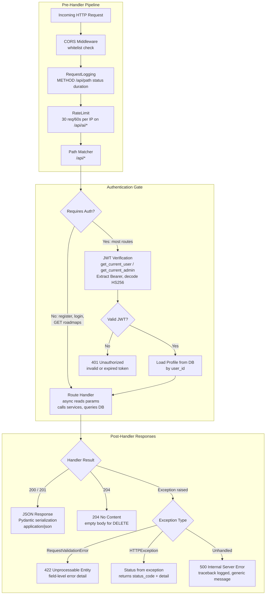

# Architecture

## Request Pipeline



Explanation of the request flow: CORS → Logging → Rate Limit → Auth Gate → Handler → Response

## Authentication & Authorization

```mermaid
flowchart TB
    subgraph AUTH["Authentication & Authorization"]
        direction TB
        AA1["Register\nbcrypt 12 rounds before DB insert"]
        AA2["Login\nverify hash, issue HS256 JWT"]
        AA3["JWT Token\nsub, role, exp, iat\nconfigurable expiry from JWT_EXPIRY_MINUTES"]
        AA4["Protected Routes\nget_current_user Depends\n403 on invalid/missing token"]
        AA5["Admin Routes\nget_current_admin Depends\nrole: admin or super_admin"]
        AA6["Super Admin\nbody-level role check\nonly super_admin PATCHES roles"]
    end

    subgraph DATA["Data Protection"]
        direction TB
        D1["SQLAlchemy ORM\nparameterized queries\nno SQL injection"]
        D2["Foreign Keys\nCASCADE on owned resources\nSET NULL on optional references"]
        D3["Race Condition\nunique constraint on email\n409 Conflict on duplicate"]
    end

    subgraph NETWORK["Network Protection"]
        direction TB
        N1["CORS Middleware\norigin whitelist from env"]
        N2["Rate Limiting\nin-memory sliding window\n30 req/60s per IP on /api/ai/*"]
    end

    subgraph FRONTEND["Frontend Protections"]
        direction TB
        F1["401 Interceptor\nclear token, redirect to login"]
        F2["Route Guards\nProtectedRoute, GuestRoute,\nAdminRoute"]
        F3["Token Storage\nlocalStorage, no httpOnly\ncookies"]
    end

    subgraph HARDENING["Production Hardening"]
        direction TB
        H1["Strong JWT_SECRET via env"]
        H2["HTTPS via reverse proxy"]
        H3["Short JWT expiry + refresh tokens"]
        H4["Redis-backed rate limiting"]
        H5["Connection pool tuning"]
        H6["CSRF protection"]
    end
```



Summary of security layers: auth flow, data protection, network protection, frontend protections, production hardening.

## File Structure

```
backend/
  app/
    core/          - config, security
    db/            - session
    middleware/    - logging, rate_limit, error_handlers, security_headers
    models/        - SQLAlchemy ORM models
    schemas/       - Pydantic schemas
    routes/        - FastAPI route handlers
    services/      - AI service
    utils/         - pagination, db_helpers
  alembic/         - migrations
  seed_data.py     - data seeder
frontend/
  src/
    pages/         - React page components
    components/    - shared, layout, roadmap
    lib/           - API client
    stores/        - Zustand stores
```

## AI Prompts Detail

| Feature | Prompt Key | What it generates |
|---|---|---|
| Explain | `EXPLAIN_PROMPT` | What it is, real-world analogy, code example, next steps |
| Simplify | `SIMPLIFY_PROMPT` | Beginner-friendly 150-word explanation with everyday analogies |
| Quiz | `QUIZ_PROMPT` | N multiple-choice questions with explanations (returns JSON) |
| Projects | `PROJECT_PROMPT` | 3 project ideas (beginner, intermediate, advanced) |
| Weekly Plan | `WEEKLY_PLAN_PROMPT` | 7-day learning schedule based on pace and completed nodes |

Responses are cached in `ai_explanations` table — subsequent requests return instantly.
