# Database

## Entity Relationship Diagram

```mermaid
erDiagram
    profiles ||--o{ user_roadmaps : enrolls
    profiles ||--o{ user_node_progress : progresses
    profiles ||--o{ notes : writes
    profiles ||--o{ bookmarks : creates
    profiles ||--o{ feedback : submits
    roadmaps ||--o{ roadmap_nodes : contains
    roadmaps ||--o{ user_roadmaps : tracked
    roadmaps ||--o{ quizzes : has
    roadmap_nodes ||--o{ node_dependencies : depends-on
    roadmap_nodes ||--o{ user_node_progress : tracked
    roadmap_nodes ||--o{ resources : has
    roadmap_nodes ||--o{ ai_explanations : cached
    roadmap_nodes ||--o{ notes : has
    roadmap_nodes ||--o{ bookmarks : bookmarked
    roadmap_nodes ||--o{ quizzes : tested-by
    roadmap_nodes ||--o{ feedback : references
    profiles ||--o{ quiz_attempts : takes
    roadmap_nodes ||--o{ quiz_attempts : targets

    profiles {
        uuid id PK
        string email UK
        string password_hash
        string full_name
        string role "user | admin | super_admin"
        int streak_days
        string avatar_url
        string bio
        string current_role
        string target_role
        int hours_per_week
        string experience_level
        boolean is_public
        datetime created_at
    }

    roadmaps {
        uuid id PK
        string slug UK
        string title
        text description
        string category
        string difficulty
        float estimated_hours
        string cover_image_url
        boolean is_published
        uuid created_by FK "ondelete SET NULL"
        datetime created_at
    }

    roadmap_nodes {
        uuid id PK
        uuid roadmap_id FK "ondelete CASCADE"
        string source_node_id
        string node_type
        string title
        text description
        string category
        string difficulty
        string why_important
        boolean is_optional
        float estimated_hours
        int order_index
        float position_x
        float position_y
        float width
        float height
    }

    node_dependencies {
        uuid node_id FK "ondelete CASCADE"
        uuid depends_on_node_id FK "ondelete CASCADE"
    }

    user_node_progress {
        uuid id PK
        uuid user_id FK "ondelete CASCADE"
        uuid node_id FK "ondelete CASCADE"
        uuid roadmap_id FK "ondelete CASCADE"
        string status "pending | in_progress | done | skipped"
        datetime updated_at
    }

    user_roadmaps {
        uuid user_id FK "ondelete CASCADE"
        uuid roadmap_id FK "ondelete CASCADE"
        datetime started_at
        datetime completed_at
        float completion_pct
        boolean is_pinned
    }

    resources {
        uuid id PK
        uuid node_id FK "ondelete CASCADE"
        string title
        string url
        string type
        boolean is_free
        boolean is_recommended
    }

    notes {
        uuid id PK
        uuid user_id FK "ondelete CASCADE"
        uuid node_id FK "ondelete CASCADE"
        text content
        datetime created_at
        datetime updated_at
    }

    bookmarks {
        uuid user_id FK "ondelete CASCADE"
        uuid node_id FK "ondelete CASCADE"
        datetime created_at
    }

    ai_explanations {
        uuid id PK
        uuid node_id FK "ondelete CASCADE"
        string prompt_type
        text response_text
        string model_used
        boolean openai_fallback
        datetime created_at
    }

    quizzes {
        uuid id PK
        uuid node_id FK "ondelete CASCADE"
        string title
        text questions_json
    }

    quiz_attempts {
        uuid id PK
        uuid user_id FK "ondelete CASCADE"
        uuid node_id FK "ondelete CASCADE"
        int score
        int total
        datetime created_at
    }

    feedback {
        uuid id PK
        uuid user_id FK "ondelete CASCADE"
        uuid node_id FK "ondelete SET NULL"
        string type
        text content
        string status "open | resolved | dismissed"
        datetime created_at
    }
```

All foreign keys use `ondelete` — owned resources (progress, notes, bookmarks, etc.) cascade; optional references (feedback → node) set null.

## Seeding

The seed script (`backend/seed_data.py`):

1. Calls the **GitHub API** to list all directories under `kamranahmedse/developer-roadmap/src/data/roadmaps/`
2. Downloads each roadmap's **React Flow JSON** file (e.g., `frontend.json`)
3. Extracts **topic nodes** (filters out labels, buttons, paragraphs)
4. Parses **edges** to build `NodeDependency` records
5. For roadmaps that have migrated from JSON to markdown content files, falls back to `fetch_markdown_topics()` — parses filenames in `{slug}/content/` into flat topic lists
6. Maps each roadmap to a hardcoded metadata entry (title, category, difficulty, description)
7. Inserts everything into PostgreSQL — **87 roadmaps with 9,531 real nodes and 9,444 dependency edges**

The script is **idempotent** — run it multiple times safely; existing roadmaps are skipped. 3-attempt retry logic handles transient GitHub API failures.

## Node Dependency Model

The NodeDependency table uses an order_index column for sequential edge ordering. Each node has indegree=1 and outdegree=1 (except first/last), ensuring a clean linear dependency chain. Verified: 0 isolated nodes across all 87 roadmaps.
