# Security

This document describes the security model of PathForge AI as implemented. It covers authentication, authorization, the main threats the application defends against, and the controls that mitigate them. For the request pipeline and deployment details, see [docs/ARCHITECTURE.md](ARCHITECTURE.md) and [docs/DEPLOYMENT.md](DEPLOYMENT.md).

## Authentication & Authorization

```mermaid
flowchart TB
    subgraph AUTH["Authentication & Authorization"]
        direction TB
        AA1["Register\nbcrypt 12 rounds before DB insert"]
        AA2["Login\nverify hash, issue HS256 JWT"]
        AA3["JWT Token\nsub, role, jti, exp, iat\nno nbf claim\nexpiry from JWT_EXPIRY_MINUTES (default 60)"]
        AA4["Protected Routes\nget_current_user Depends\n403 on missing header\n401 on invalid or expired token"]
        AA5["Admin Routes\nget_current_admin Depends\nrole: admin or super_admin\n403 for other roles"]
        AA6["Role Changes\nsuper_admin only\n403 otherwise"]
    end

    subgraph DATA["Data Protection"]
        direction TB
        D1["SQLAlchemy ORM\nparameterized queries\nno SQL injection"]
        D2["Foreign Keys\nCASCADE on owned resources\nSET NULL on optional references"]
        D3["Unique Email\nrace-condition safe\n409 Conflict on duplicate"]
    end

    subgraph NETWORK["Network Protection"]
        direction TB
        N1["CORS Middleware\norigin whitelist from env"]
        N2["Security Headers\nnosniff, X-Frame-Options DENY,\nHSTS, Cache-Control no-store"]
        N3["Rate Limiting\nin-memory 24h sliding window\nkeys: user_id:prefix\nauth 20/day, AI 5/day free / 20/day registered"]
    end

    subgraph FRONTEND["Frontend Protections"]
        direction TB
        F1["401 Interceptor\nclear token, redirect to login"]
        F2["Route Guards\nProtectedRoute, GuestRoute,\nAdminRoute"]
        F3["Token Storage\nlocalStorage, not httpOnly cookies"]
        F4["Content-Security-Policy\nmeta tag in index.html"]
    end
```

Authentication and authorization are enforced entirely on the backend through three FastAPI dependencies in `backend/app/core/security.py`:

- `get_current_user` — requires a valid Bearer token, then loads the `Profile` from the database by the `sub` claim.
- `get_optional_user` — returns the profile if a valid token is present, otherwise `None` (uses `HTTPBearer(auto_error=False)`).
- `get_current_admin` — chains on `get_current_user` and requires role `admin` or `super_admin`.

Status code behavior (verified against the code):

- Missing or malformed `Authorization` header -> `403` (raised by `HTTPBearer(auto_error=True)` before the handler runs).
- Present but invalid or expired token -> `401` (raised by `decode_token`; "Token expired" / "Invalid token").
- Valid token but user no longer exists in the DB -> `401`.
- Non-admin role on an admin endpoint -> `403`.
- Role change attempted by a non-super-admin -> `403`.

## Authentication Flow

1. **Register** — `POST /api/auth/register` validates the input via Pydantic (`EmailStr`, password 6-128 chars), hashes the password with bcrypt (12 rounds) and inserts the row. The unique constraint on `email` makes concurrent duplicate registrations safe: an `IntegrityError` becomes `409 Conflict`. A JWT is issued immediately on success.
2. **Login** — `POST /api/auth/login` looks the user up by email and verifies the stored bcrypt hash. Invalid credentials always return `401` (no user enumeration). On success a fresh JWT is issued.
3. **JWT** — HS256-signed with `JWT_SECRET`. Claims: `sub` (user UUID), `role`, `jti` (unique per token), `exp`, `iat`. There is no `nbf` claim. Expiry is set from `JWT_EXPIRY_MINUTES` (default 60).
4. **Protected requests** — the client sends `Authorization: Bearer <token>`. The backend verifies the signature and expiry, loads the current user from the DB, and checks authorization.
5. **Expiry** — refresh tokens are **not implemented**. Once `exp` passes, the token is rejected with `401` and the user must re-authenticate. The frontend 401 interceptor removes the stored token and redirects to `/login?redirect=...`.

**OAuth** — `POST /api/auth/social` supports two providers:

- **Google**: the frontend obtains a Google access token and sends it; the backend validates it against `https://www.googleapis.com/oauth2/v3/userinfo`.
- **GitHub**: the frontend redirects for an authorization code and sends it; the backend exchanges the code (plus `GITHUB_CLIENT_SECRET`) for an access token, then fetches the user profile (with a `/user/emails` fallback if no primary email).

First-time OAuth users are auto-provisioned with role `user`.

## Authorization Model

| Role        | Capabilities                                                                                              |
|-------------|-----------------------------------------------------------------------------------------------------------|
| `user`      | Default on registration/OAuth. Read public roadmaps; manage own progress, notes, bookmarks, feedback; use AI features (subject to rate limits). |
| `admin`     | Everything `user` can do, plus admin endpoints: `/api/admin/stats`, `/api/admin/users`, `/api/admin/feedback` moderation. |
| `super_admin` | Everything `admin` can do, plus `PATCH /api/admin/users/{id}/role` (validated against `{user, admin, super_admin}`). |

Enforcement notes:

- The role is read from the **database** at request time (`get_current_user` loads a fresh `Profile`), never trusted from the token claim, so role changes take effect immediately.
- `ProfileUpdate` (`PATCH /api/me`) does not expose `role` or `password_hash`, so users cannot self-promote or change their own credentials through the profile endpoint.
- Frontend route guards (`ProtectedRoute`, `GuestRoute`, `AdminRoute`) are UX conveniences only; every protection is enforced server-side.

## Threat Model

| Threat | Mitigation |
|---|---|
| Credential theft (password database leak) | bcrypt password hashing (12 rounds); plaintext passwords are never stored and never returned by the API. |
| Brute force / credential stuffing | Rate limiting on `/api/auth/*` (20 requests/day per user bucket), `429` on exceed. |
| Token forgery | HS256 HMAC signatures with `JWT_SECRET` (minimum 32 chars enforced at startup); the signature is verified on every request. |
| Token replay / theft | Short expiry (`JWT_EXPIRY_MINUTES`, default 60) and a unique `jti` per token. Note: no refresh tokens and no server-side revocation — a stolen token stays valid until expiry. |
| SQL injection | SQLAlchemy ORM with parameterized queries throughout; no string-built SQL. |
| XSS | React escapes by default; CSP meta tag in `index.html`; `X-Content-Type-Options`, `X-Frame-Options`, and `X-XSS-Protection` headers. Trade-off: the JWT lives in `localStorage`, so any successful XSS could exfiltrate it — CSP reduces but does not eliminate this risk. |
| CSRF | Bearer tokens in the `Authorization` header (not cookies), so there are no ambient credentials for classic CSRF to ride on. |
| Insecure direct object references (IDOR) | All user-scoped queries filter by `user.id` (progress, notes, bookmarks, feedback); admin data sits behind `get_current_admin`. |
| Privilege escalation | Role not editable via `/api/me`; role changes require `super_admin` and are validated against an allowlist. |
| Data exposure / mass assignment | Pydantic request schemas whitelist fields; `ProfileRead` excludes `password_hash`; unhandled exceptions return a generic `500` without stack traces. |
| Leaked secrets | `.env` files are gitignored; startup validation fails unless `JWT_SECRET` is at least 32 chars; API keys and tokens are never logged. |
| Abuse / DoS on AI routes | Rate limits (5/day free, 20/day registered) plus response caching in the `ai_explanations` table. |
| OAuth abuse | Provider-side verification: the Google token is validated against the userinfo endpoint; the GitHub code is exchanged using the server-side client secret. |

## Security Practices

- Passwords hashed with bcrypt (12 rounds) via `passlib` `CryptContext`.
- JWT HS256 with configurable expiry (`JWT_EXPIRY_MINUTES`, default 60); claims `sub`, `role`, `jti`, `exp`, `iat` (no `nbf`).
- Token signature verified on every protected request; authorization reads `role` from the database, not from the token.
- `get_current_user` / `get_optional_user` / `get_current_admin` dependencies with correct status codes: missing header `403`, invalid/expired token `401`, non-admin `403`.
- Admin endpoints require `admin` or `super_admin`; role changes require `super_admin`.
- SQLAlchemy parameterized queries prevent SQL injection.
- Foreign keys use `ondelete CASCADE` (owned resources) and `SET NULL` (optional references).
- Unique constraint on `email`; duplicate registration returns `409`.
- Pydantic input validation on every request body (`EmailStr`, password length 6-128, enum/pattern checks); validation errors return `422` with field-level detail.
- Rate limiting with compound in-memory sliding-window keys `user_id:prefix`: 20/day for auth, 5/day anonymous and 20/day registered for AI, `429` on exceed. `AI_CALLS_PER_DAY_PREMIUM` (999) is reserved for future tiered access and is not yet enforced.
- CORS whitelist from `CORS_ORIGINS` (no wildcard); `allow_credentials=True` with explicit origins.
- Security headers: `X-Content-Type-Options: nosniff`, `X-Frame-Options: DENY`, `X-XSS-Protection: 1; mode=block`, `Strict-Transport-Security`, `Cache-Control: no-store`.
- Frontend CSP meta tag restricting `script-src`, `connect-src`, and `frame-src`.
- Startup validation: `JWT_SECRET` >= 32 chars, `DATABASE_URL` required, `DEBUG` forced off under `PRODUCTION`.
- Request logging with `X-Request-ID` correlation; error responses include `request_id`; unhandled exceptions return a generic `500`.

## Secret Handling

- `JWT_SECRET` is required at startup (minimum 32 chars) and is validated by `Settings.validate_startup`. Generate one with `python -c "import secrets; print(secrets.token_hex(32))"`.
- `.env`, `.env.local`, `.env.production`, and friends are gitignored. Only `.env.example` (with empty placeholders) is committed.
- Provider credentials (`GOOGLE_CLIENT_ID`, `GITHUB_CLIENT_ID`, `GITHUB_CLIENT_SECRET`) and AI keys (`GEMINI_API_KEY`, `OPENAI_API_KEY`) are read from the environment only.
- The request logger records method, path, and status only — never tokens, passwords, or API keys.
- Rotate `JWT_SECRET` on any suspected compromise; rotating it invalidates every outstanding token. Secrets should never be committed, shared, or logged.

## Production Hardening Checklist

- [ ] Terminate TLS / serve HTTPS (the app already emits the HSTS header).
- [ ] Set a strong random `JWT_SECRET` (>= 32 chars); never ship the default empty value.
- [ ] Keep `JWT_EXPIRY_MINUTES` short (60 or less) and expect re-auth on expiry (no refresh tokens yet).
- [ ] Set `CORS_ORIGINS` to the exact production frontend origin; set `PRODUCTION=1` and `DEBUG=false`.
- [ ] Replace the in-memory rate limiter for multi-instance deployments: it is per-process, in-memory, and resets on restart — use a Redis-backed limiter when scaling horizontally.
- [ ] Add infrastructure-level rate limiting (see the nginx `limit_req` config in docs/DEPLOYMENT.md).
- [ ] Schedule database backups with tested restore procedures; encrypt backups at rest.
- [ ] Monitor `401`/`403`/`429`/`500` rates and correlate via `X-Request-ID`; alert on unusual auth failure spikes.
- [ ] Run dependency and image vulnerability scanning (`pip-audit`, `npm audit`, container scans) in CI.
- [ ] Validate the deployment against the checklist and env matrix in [docs/DEPLOYMENT.md](DEPLOYMENT.md).

## References

- [docs/ARCHITECTURE.md](ARCHITECTURE.md) — request pipeline and middleware order.
- [docs/API.md](API.md) — endpoint reference and rate-limit details.
- [docs/DEPLOYMENT.md](DEPLOYMENT.md) — production setup, secrets, and infrastructure hardening.
- [README.md](../README.md) — project overview and environment variables.
