# Security

## Authentication & Authorization

```mermaid
flowchart TB
    subgraph AUTH["Authentication & Authorization"]
        direction TB
        AA1["Register\nbcrypt 12 rounds before DB insert"]
        AA2["Login\nverify hash, issue HS256 JWT"]
        AA3["JWT Token\nsub, role, exp, iat\nconfigurable expiry from JWT_EXPIRY_MINUTES"]
        AA4["Protected Routes\nget_current_user Depends\n403 on invalid/missing token"]
        AA5["Admin Routes\nget_current_admin Depends\nrole: admin or super_admin"]
        AA6["Super Admin\nbody-level role check\nonly super_admin PATCHES roles"]
    end

    subgraph DATA["Data Protection"]
        direction TB
        D1["SQLAlchemy ORM\nparameterized queries\nno SQL injection"]
        D2["Foreign Keys\nCASCADE on owned resources\nSET NULL on optional references"]
        D3["Race Condition\nunique constraint on email\n409 Conflict on duplicate"]
    end

    subgraph NETWORK["Network Protection"]
        direction TB
        N1["CORS Middleware\norigin whitelist from env"]
        N2["Rate Limiting\nin-memory sliding window\n30 req/60s per IP on /api/ai/*"]
    end

    subgraph FRONTEND["Frontend Protections"]
        direction TB
        F1["401 Interceptor\nclear token, redirect to login"]
        F2["Route Guards\nProtectedRoute, GuestRoute,\nAdminRoute"]
        F3["Token Storage\nlocalStorage, no httpOnly\ncookies"]
    end

    subgraph HARDENING["Production Hardening"]
        direction TB
        H1["Strong JWT_SECRET via env"]
        H2["HTTPS via reverse proxy"]
        H3["Short JWT expiry + refresh tokens"]
        H4["Redis-backed rate limiting"]
        H5["Connection pool tuning"]
        H6["CSRF protection"]
    end
```

## Security Practices

- Passwords hashed with bcrypt (12 rounds)
- JWT tokens with configurable expiry (JWT_EXPIRY_MINUTES)
- Admin routes protected by get_current_admin dependency
- Super admin role required for role changes
- SQLAlchemy ORM prevents SQL injection via parameterized queries
- CORS whitelist configured via environment
- Rate limiting: 20 req/day for auth, 5/20/999 req/day for AI (free/registered/premium)
- Race-condition safe registration via unique constraint on email
